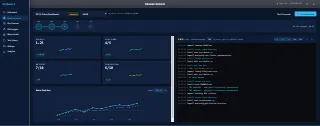

<div align="center">

# BigPowers Benchmark

**The native macOS scorecard for AI coding agents.**

[](https://developer.apple.com/macos/)
[](https://swift.org)
[](LICENSE)
[](https://conventionalcommits.org)

<br/>



</div>

---

## What it does

BigPowers Benchmark runs AI coding agents against a curated task suite inside an isolated [Daytona](https://www.daytona.io/) sandbox, scores each attempt automatically, and gives you a persistent record you can slice, compare, and version-control.

One click → opencode attempts the task → scores appear → JSON shard is committed to git. No manual grading, no clipboard-shuffling, no spreadsheets.

---

## Table of Contents

- [Features](#features)
- [Screens](#screens)
- [How scoring works](#how-scoring-works)
- [Architecture](#architecture)
- [Prerequisites](#prerequisites)
- [Getting started](#getting-started)
- [Data format](#data-format)
- [Themes](#themes)
- [Contributing](#contributing)
- [License](#license)

---

## Features

| | |
|---|---|
| **Live terminal panel** | Stream opencode's stdout/stderr with ANSI color coding as the run happens |
| **Automated grading** | `score_run.sh` runs inside the sandbox — no human entry, no drift |
| **Git-native results** | Every `BenchRow` is a JSON shard auto-committed to `~/runs/data/` |
| **12 themes** | Dark (canonical) + Light, Mono, Ocean, Forest, Ember, Violet, Midnight, Crimson, Slate, Amber, Rose |
| **Skill Coverage Radar** | Canvas polar chart mapping bigpowers methodology dimensions to a visual polygon |
| **Regression detection** | Analytics screen flags statistically significant score drops across `bigpowersRef` versions |
| **Model Registry** | Pulls live metadata from `models.dev` + provider APIs — never a stale static list |
| **MenuBarExtra** | Live run progress in the menu bar without keeping the main window open |
| **Keychain-only secrets** | API keys never touch disk or env vars |

---

## Screens

| Screen | Purpose |
|--------|---------|
| **Dashboard** | Score evolution line chart, metric cards, sparklines, model leaderboard |
| **Mission Control** | Launch a run — Task stepper, live Terminal Panel, run controls |
| **Run Explorer** | Sortable / filterable table of every `BenchRow`; multi-select compare mode |
| **Skill Insights** | Skill Coverage Radar + per-skill bars; shows where the bigpowers methodology helps or fails |
| **Model Health** | Leaderboard by `overallScore`; provider-level status |
| **Task Library** | Browse tasks by category and difficulty |
| **Analytics** | Cross-run heatmaps, methodology waterfall, automated Regression alerts |
| **Settings** | Daytona URL, task repo, theme picker, Keychain API keys, auto-commit / auto-push |

> Design references for every screen live in [`specs/assets/prototypes/`](specs/assets/prototypes/) as pixel-perfect HTML prototypes. Open any `.html` file in a browser to see exactly what the native app will look like.

---

## How scoring works

Each run produces three sub-scores, computed automatically by `score_run.sh` inside the sandbox:

```
codePass        0 or 1   — did test.js exit 0?
artifactScore   0–2      — spec .md files in specs/ (0 = none, 1–2 = one or two, 3+ = two)
conventionScore 0–2      — git commit quality (0 = no commits, 1 = non-CC, 2 = ≥1 Conventional Commit)

overallScore = (codePass × 2 + artifactScore + conventionScore) / 4
```

`codePass` is weighted double — passing tests is the minimum bar. Everything else is methodology hygiene.

---

## Architecture

```
BigPowers Benchmark
├── BenchmarkRunner (Swift actor)
│   ├── Reset workspace — delete + re-clone task repo at bigpowersRef inside Daytona sandbox
│   ├── Run opencode   — Daytona PTY API → AsyncStream<LogLine>
│   ├── Grade          — Daytona process API runs score_run.sh → JSON sub-scores
│   └── Persist        — builds BenchRow, delegates to BenchmarkStore
│
├── BenchmarkStore (service)
│   ├── Writes JSON shards to ~/runs/data/run_<ISO8601>_<taskId>.json
│   ├── DispatchSource directory watcher — live UI reload on external writes
│   └── Optional auto-commit + auto-push via git
│
├── SwiftUI shell
│   ├── NavigationSplitView sidebar
│   ├── Table (Run Explorer, Model Health)
│   ├── Swift Charts (score evolution, Analytics heatmap)
│   ├── Canvas+Path (Skill Coverage Radar)
│   └── NSViewRepresentable(NSTextView) (Terminal Panel, ANSI)
│
└── Daytona sandbox (external)
    ├── bigpowers skillset at a pinned bigpowersRef
    ├── opencode CLI
    └── score_run.sh
```

**Key constraints that are never relaxed:**

1. One run at a time — no queue, no parallelism (compute constraint)
2. opencode runs inside the sandbox — never on the host (version isolation)
3. Fresh clone per run — `git reset` was rejected; contamination risk is real
4. Scores are computed by `score_run.sh` only — no human entry path exists

---

## Prerequisites

| Dependency | Where to get it |
|------------|----------------|
| macOS 14 Sonoma or later | System update |
| Xcode 15+ | Mac App Store |
| Daytona | [daytona.io](https://www.daytona.io/) |
| `opencode` CLI | `brew install anomalyco/tap/opencode` |
| A `~/runs/data/` git repo | `git init ~/runs/data && cd ~/runs/data && git commit --allow-empty -m "init"` |

---

## Getting started

```bash
# 1. Clone
git clone https://github.com/danielvm-git/bigpowers-benchmark.git
cd bigpowers-benchmark

# 2. Open in Xcode
open BigPowersBenchmark.xcodeproj

# 3. Build & run (⌘R)
#    The app will prompt you to configure Daytona URL and API key on first launch.
```

**First-run checklist:**

- [ ] Settings → Daytona URL — paste your Daytona instance URL
- [ ] Settings → Daytona API Key — stored in Keychain, never in any file
- [ ] Settings → Task Repo URL — URL of your task repository
- [ ] Create at least one Daytona sandbox with the bigpowers skillset pre-installed
- [ ] The sandbox label should reflect the `bigpowersRef` (e.g. `bigpowers-v1.2.0`)

**Debugging:** Logs go to `~/Library/Logs/BigPowersBenchmark/debug.ndjson`. Use **Help → Copy Debug Log** (⇧⌘L) to paste NDJSON into Cursor, or `tail -f` that file while reproducing an issue. Run `bash scripts/setup.sh` once to create log and runs directories.

---

## Data format

Every completed run is a JSON shard at `~/runs/data/run_<ISO8601>_<taskId>.json`:

```json
{
  "id": "550e8400-e29b-41d4-a716-446655440000",
  "timestamp": "2026-05-23T14:32:00Z",
  "bigpowers_ref": "v1.2.0",
  "model_name": "openrouter/anthropic/claude-sonnet-4.6",
  "task_id": "T01_bug_investigation",
  "code_pass": 1,
  "artifact_score": 2,
  "convention_score": 2,
  "overall_score": 1.0,
  "duration": 47.3,
  "cost": 0.0024,
  "workspace": "/home/user/workspace/T01_bug_investigation"
}
```

The schema round-trips identically between the SwiftUI app and any future Tauri port.

---

## Themes

The app ships with 12 themes, all built on the same design token system (`--accent`, `--bg`, `--surface`, `--good`, `--bad`, …). The canonical theme is **Dark**.

| Theme | Accent |
|-------|--------|
| Dark *(default)* | `#2dd4bf` teal |
| Light | `#14b8a6` teal |
| Mono | `#ffffff` white |
| Ocean | `#38bdf8` sky |
| Forest | `#10b981` green |
| Ember | `#fb923c` orange |
| Violet | `#a78bfa` purple |
| Midnight | `#818cf8` indigo |
| Crimson | `#fb7185` rose |
| Slate | `#64748b` cool gray |
| Amber | `#fbbf24` gold |
| Rose | `#f472b6` pink |

---

## Contributing

All work goes through a feature branch — never commit directly to `main`.

```bash
git switch -c feature/your-feature
```

Commits must follow [Conventional Commits](https://conventionalcommits.org).  
Pre-commit hooks enforce formatting (`swiftformat`) and linting (`swiftlint`).

See [`CONVENTIONS.md`](CONVENTIONS.md) for the full contribution guide.

---

## License

MIT © Daniel VM
